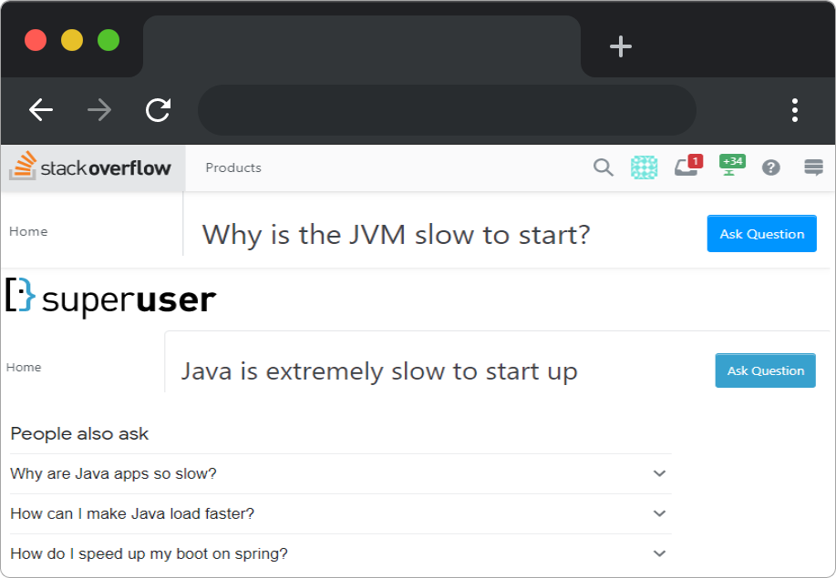
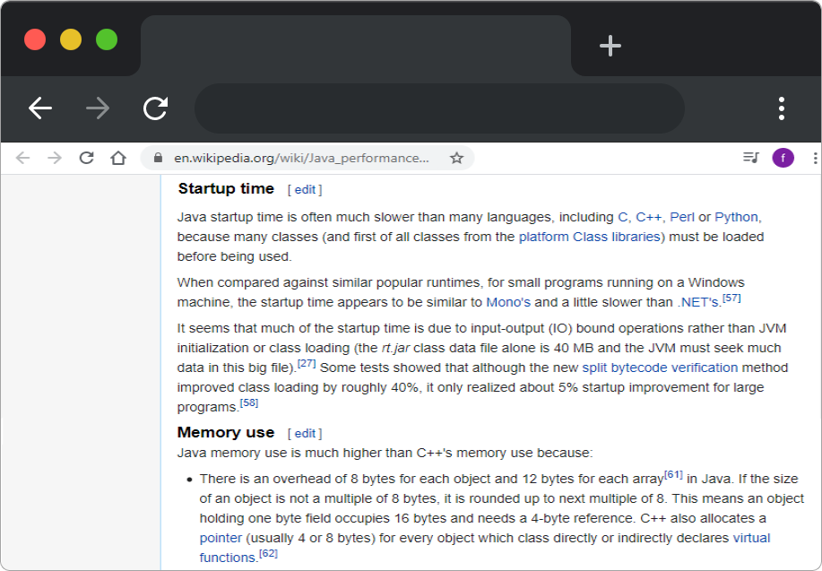
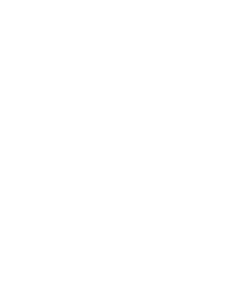
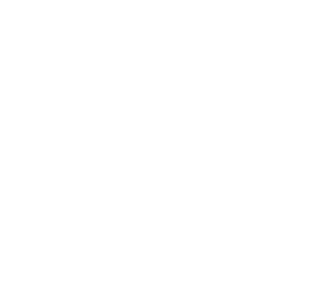
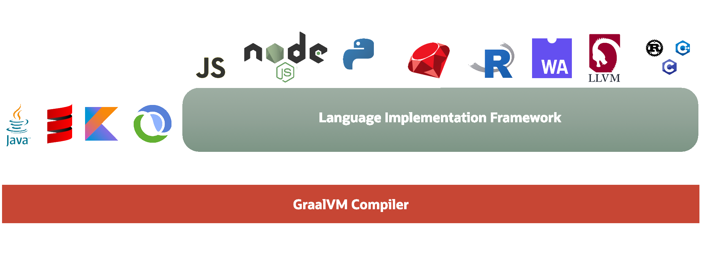
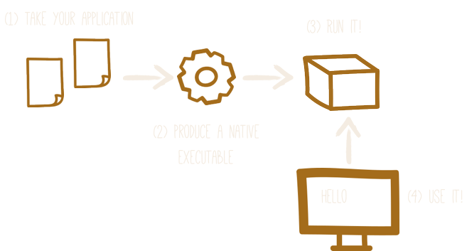
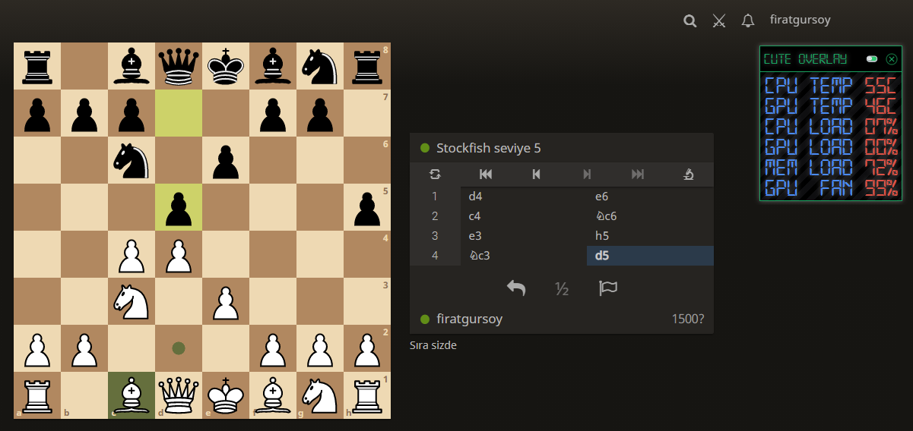

<!-- _footer: Fırat GÜRSOY - Senior Software Developer / May 2021--> 


# About


#


---
# The question is


---
# What we can do?


---
# So what is the solution?


---
# What is GraalVM ?

`GraalVM` is a **high-performance** JDK distribution designed to **accelerate the execution of applications** written in `Java` and other JVM languages along with support for `JavaScript`, `Ruby`, `Python` and **_a number of other popular languages_**. `GraalVM`’s polyglot capabilities make it possible to mix multiple programming languages in a single application while **_eliminating foreign language call costs_**.

---
# What can GraalVM give me?
* Mix multiple programming languages in a single application 
* Native executables
* ``Amazingly`` fast boot time
* Incredibly ``low RSS memory`` (not just heap size!)
* Instant (relatively) scale up and high density memory utilization in container orchestration platforms like ``Kubernetes``.

---

# GraalVM Architecture



---
# Native Image




###### The ``native executable`` for our application will contain the ``application code``, ``required libraries``, ``Java APIs``, and ``a reduced version of a VM``. The smaller VM base improves the ``startup time`` of the application and produces a ``minimal disk footprint``.


---

# Truffle language implementation framework 

The Truffle language implementation framework (henceforth “Truffle”) is an open source library for building tools and programming languages implementations as interpreters for self-modifying Abstract Syntax Trees. Together with the open source GraalVM compiler, ``Truffle represents a significant step forward in programming language implementation technology in the current era of dynamic languages.``

---
# Supported Frameworks and Tech

* Spring Framework (Experimental)
* Quarkus
* Play Framework
* Camel
* Prometheus
* JavaFX
...

---
# Disadvantages

* The main downside of this approach is the platform-depended native code. 

That means you need to compile source code for linux/windows etc.

---
<!-- 
class:
  - uncover
  - invert
 -->

# Meanwhile ??

``SystemAdmin01:`` server_api.so doesn't work on my server !
``Customer$$$__:`` customer_api.exe doesn't work on my pc !
``DevGuy42_____:`` api.jar works on my workstation !
``Fırat________:`` In some cases, problems may arise from the libraries or build scripts used. In other words, it is necessary to pay attention to  **tests**.
``SystemAdmin01:`` hımm, server_api.so doest work on my server !
...........................................
``DevGuy42 writing ...``

---

<!-- 
class:
  - lead
  - invert
 -->

# Tests : Sure

```java
package org.acme.quickstart;


import io.quarkus.test.junit.NativeImageTest;

@NativeImageTest 
public class NativeGreetingResourceIT extends GreetingResourceTest { 
    // Run the same tests
}
```

---
# Performance


Quarkus Test

---
After this experience i made a demo application for my requirement. It's really reducing startup and memory footprint dramatically. :)



---
<!-- _footer: Fırat GÜRSOY - Senior Software Developer / May 2021--> 
# Spacial thanks to

* Oracle
* Quarkus
* Spring
* JavaFX / GluonHQ
* Google and Wiki

and mostly to
